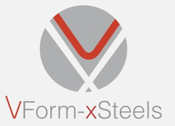

**vxformsapi** is a Python library to enable a high-level interaction with the VxForms Material's [API](http://193.137.84.5/api/swagger/) without the need of the VXForms Materials's [Website](http://193.137.84.5).

The project is being developed in association with University of Aveiro - Portugal, and it is currently mantained by the research grant team.

## Installation
### Dependencies
vxformsapi automatically install the following dependencies:
- pandas
- requests

### User Instalation
```
pip install vxformsapi
```

## Documentation
### Authentication
Some methods will require the `login_token` argument to allow for permissions or uploads. There are 2 ways to obtain the token:
```python
from vxformsapi.API import *
login_token = authenticate("username_value", "password_value") 
# Uses hardcoded information. 
# Not recommended if the script is associated with a repository for security reasons.

login_token_json = authenticate_from_json("json_filename.json")
# Recommended approach for security.
# Uses information provided in the json file that follows the following structure:
# {
#   username: "username_value",
#   password: "password_value"
# }

```
The login_token can now be used in any necessary method passing it as an argument.

### Materials

`get_materials`: Retrieve a page of materials.
```
Parameters
----------
page (optional) : int
    Page number
page_size (optional) : int
    Number of materials per page
ordering (optional) : MaterialOrderings
    Ordering of the material list (available orderings: id, date, name, upper/middle/lower_category)
ascending (optional) : bool
    Defines ordering direction
search (optional) : str
    Filters materials by inclusion of the specified string in the material name or description
```

`get_material`: Retrieve a material by id.
```
Parameters
----------
material_id : int
    The id of the material to be fetched
```